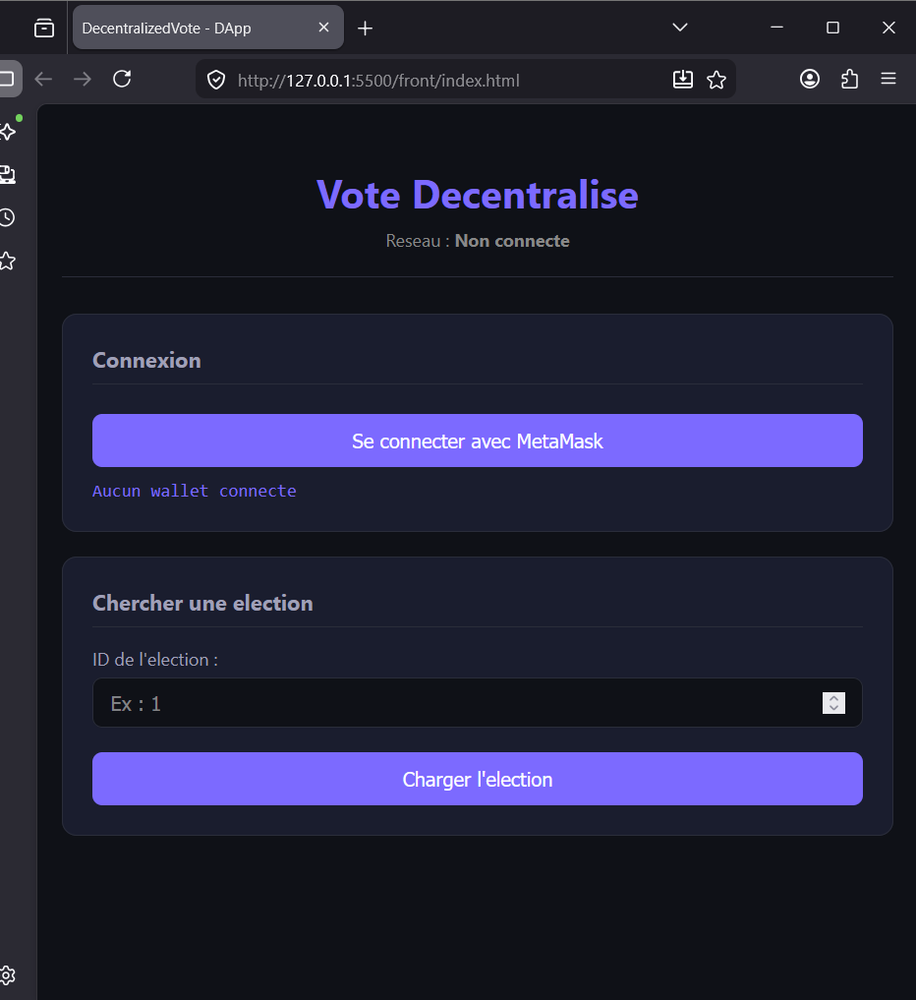
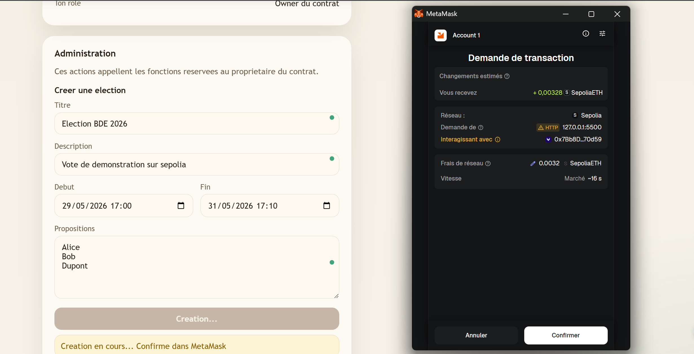
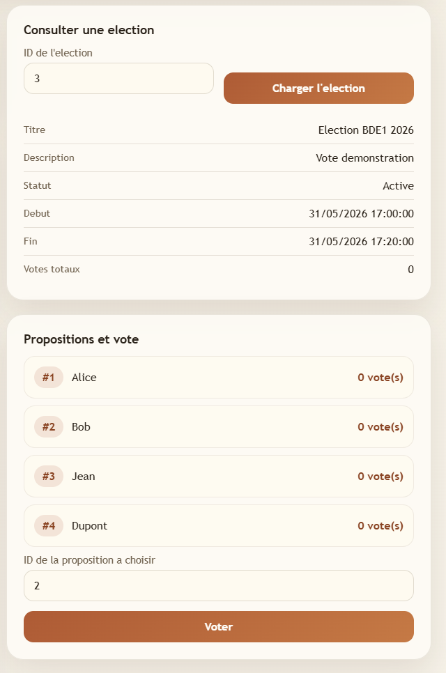
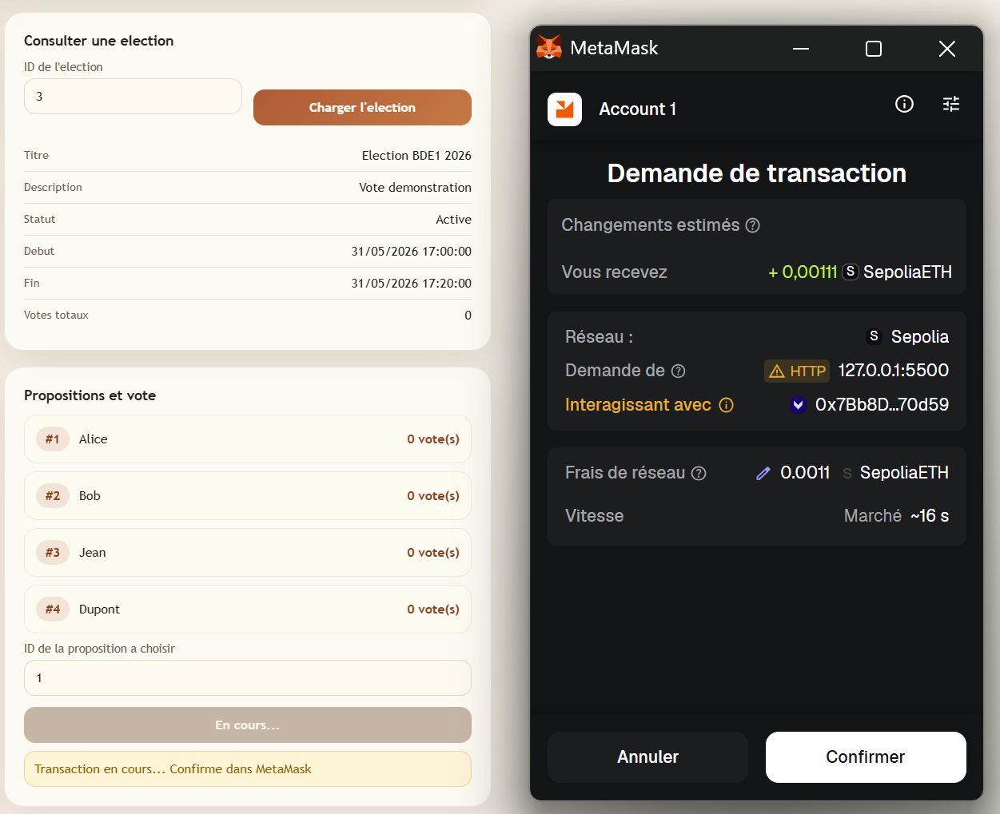
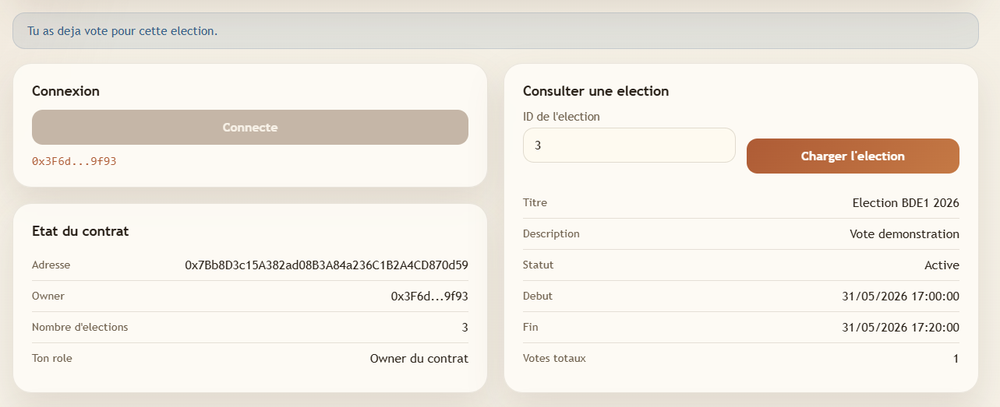
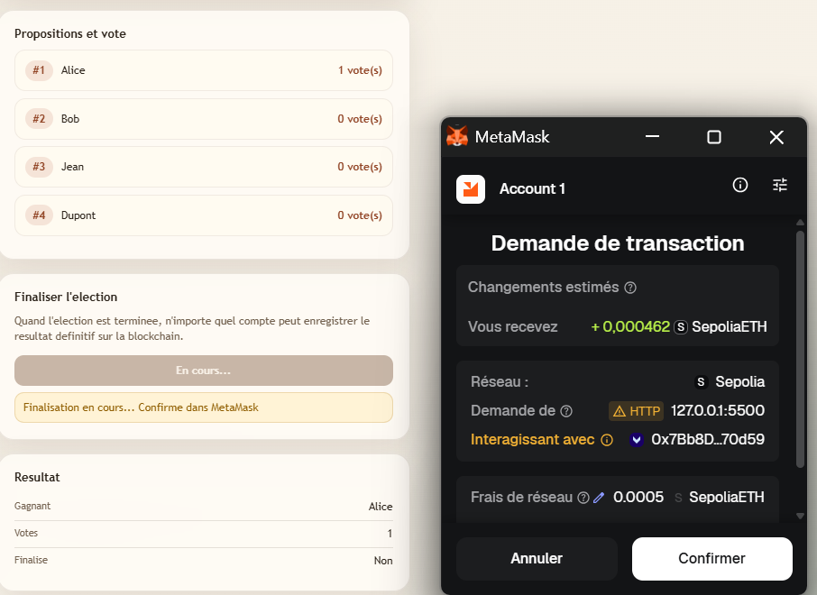
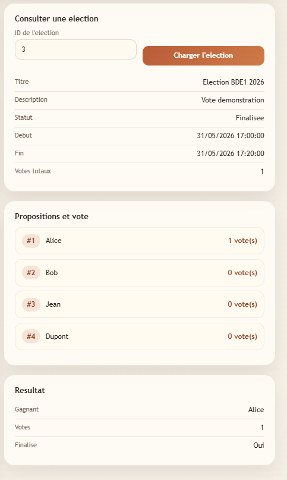
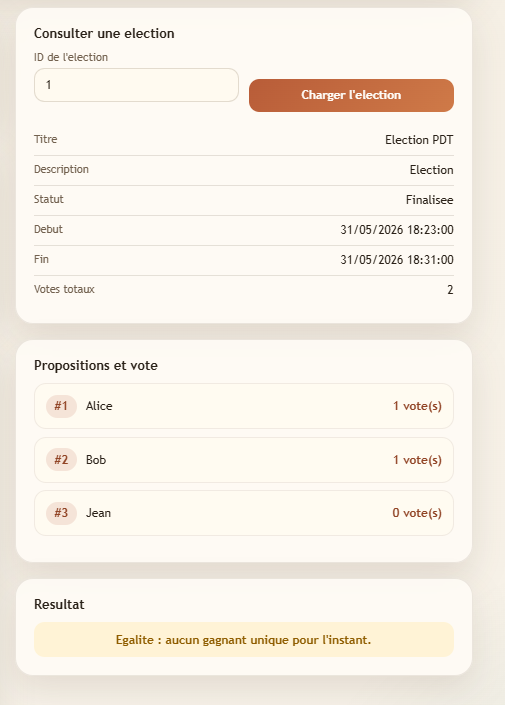
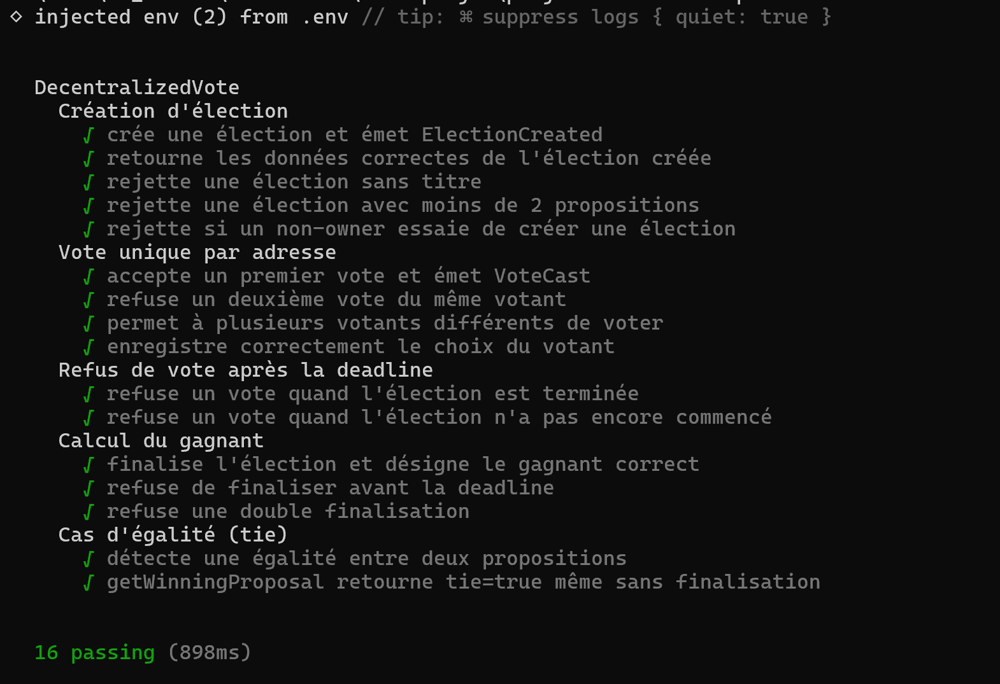

# Vote Décentralisé — DApp Blockchain

> Mini-projet final · IT University Madagascar · Blockchain 2025/2026  
> Groupe : **Iaritina** · **Haroavo** · **Mezana** · **Salema**

---

## Description

Application décentralisée (**DApp**) de vote sur la blockchain Ethereum. Les élections, les propositions et les votes sont enregistrés **on-chain** via un smart contract Solidity déployé sur le réseau de test **Sepolia**. L'interface front-end permet de se connecter avec MetaMask, de consulter les élections actives et de voter.

**Fonctionnalités :**

- Création d'élections avec propositions on-chain (réservé à l'owner)
- **Vote unique par adresse** Ethereum — impossibilité de voter deux fois
- Clôture automatique par **deadline** (`block.timestamp`)
- Finalisation du résultat on-chain avec détection d'**égalité**
- Front-end HTML/CSS/JS connecté au contrat via **ethers.js v6**

---

## Contrat déployé sur Sepolia

| Réseau          | Adresse du contrat                           |
| --------------- | -------------------------------------------- |
| Sepolia Testnet | `0x59A8C32Fc5A6F3F1b62C87f815946836D10E4c81` |

Voir sur Etherscan : https://sepolia.etherscan.io/address/0x59A8C32Fc5A6F3F1b62C87f815946836D10E4c81

---

## Front-end (GitHub Pages)

> Lien public : https://salema29.github.io/projet-blockchain/

---

## Architecture

```
Utilisateur / Wallet  →  MetaMask  (signature des transactions)
Front-end             →  HTML + CSS + ethers.js v6  (front/)
Smart Contract        →  Solidity 0.8.24 + Hardhat  (contracts/)
Blockchain            →  Ethereum Sepolia Testnet
```

---

## Structure du repository

```
projet-blockchain/
├── README.md                        ← Ce fichier (Salema)
├── contracts/
│   └── DecentralizedVote.sol        ← Smart contract principal (Iaritina)
├── test/
│   └── DecentralizedVote.test.js    ← 16 tests unitaires Hardhat (Salema)
├── scripts/
│   ├── deploy.js                    ← Déploiement Sepolia (Haroavo)
│   └── create-election.js           ← Création d'une élection de démo (Haroavo)
├── front/
│   ├── index.html                   ← Interface DApp (Mezana)
│   ├── style.css                    ← Styles
│   ├── app.js                       ← Logique ethers.js
│   └── abi.js                       ← ABI + adresse du contrat déployé
├── screenshots/                     ← Captures d'écran de la DApp (Mezana + Salema)
├── .github/
│   └── workflows/
│       └── pages.yml                ← Déploiement automatique GitHub Pages (Salema)
├── hardhat.config.js
├── package.json
└── .gitignore
```

---

## Installation

```bash
# Cloner le repository
git clone https://github.com/salema29/projet-blockchain.git
cd projet-blockchain

# Installer les dépendances
npm install
```

---

## Tests unitaires

Les tests couvrent les 4 cas principaux définis dans le cahier des charges :

```bash
npm test
```

| Suite de tests               | Cas couverts                                                                                               |
| ---------------------------- | ---------------------------------------------------------------------------------------------------------- |
| Création d'élection          | Création valide + événement, données retournées, rejet titre vide, rejet < 2 propositions, rejet non-owner |
| Vote unique par adresse      | Premier vote + événement, refus double vote, plusieurs votants, enregistrement du choix                    |
| Refus de vote après deadline | Rejet vote après clôture, rejet vote avant ouverture                                                       |
| Calcul du gagnant            | Désignation gagnant correct, refus finalisation avant deadline, refus double finalisation                  |
| Cas d'égalité (bonus)        | Égalité détectée après finalisation, `getWinningProposal` retourne `tie=true` en live                      |

**16 tests — tous passants.**

---

## Déploiement du contrat

### Pré-requis

- Node.js >= 18
- Un wallet Ethereum avec des SepoliaETH (faucet : https://sepoliafaucet.com)
- Un nœud RPC Sepolia (Infura ou Alchemy)

### Configuration

Créer un fichier `.env` à la racine du projet :

```env
SEPOLIA_RPC_URL=https://sepolia.infura.io/v3/VOTRE_CLE_API
PRIVATE_KEY=votre_cle_privee_sans_0x
```

### Lancer le déploiement

```bash
npm run deploy
```

Le script affiche l'adresse du contrat déployé et le lien Etherscan correspondant.

### Créer une élection de démonstration

Après déploiement, mettre à jour `CONTRACT_ADDRESS` dans `scripts/create-election.js`, puis :

```bash
npx hardhat run scripts/create-election.js --network sepolia
```

---

## Utilisation du front-end

1. Ouvrir `front/index.html` dans un navigateur (ou accéder via le lien GitHub Pages)
2. Connecter MetaMask sur le réseau **Sepolia Testnet** (chain ID : 11155111)
3. Entrer l'ID d'une élection et cliquer **Charger l'election**
4. Consulter les propositions et leur nombre de votes
5. Entrer l'ID d'une proposition et cliquer **Voter**
6. Confirmer la transaction dans MetaMask

---

## Captures d'écran

|                   Page initiale                    |                      Connexion MetaMask                      |
| :------------------------------------------------: | :----------------------------------------------------------: |
|  |  |

|               Création d'une élection avec demande de transaction               |                  Détail de l'élection après création                  |
| :-----------------------------------------------------------------------------: | :-------------------------------------------------------------------: |
|  |  |

|                     Vote et demande de transaction                     |                Sécurité : vote déjà effectué                 |
| :--------------------------------------------------------------------: | :----------------------------------------------------------: |
|  |  |

|                        Finalisation de l'élection                        |                    Résultat après enregistrement                    |
| :----------------------------------------------------------------------: | :-----------------------------------------------------------------: |
|  |  |

|                   Cas d'égalité sans gagnant                   |           Tests unitaires Hardhat           |
| :------------------------------------------------------------: | :-----------------------------------------: |
|  |  |

---

## Points bonus

### Tests unitaires Hardhat

Dossier `test/` avec 16 tests organisés en 5 suites. Lancer avec `npm test`.

### Documentation NatSpec

Toutes les fonctions publiques du contrat sont documentées avec `@notice`, `@param` et `@return` directement dans `contracts/DecentralizedVote.sol`.

### Déploiement GitHub Pages

Le dossier `front/` est déployé automatiquement sur GitHub Pages via le workflow `.github/workflows/pages.yml` à chaque push sur `main`.

### OpenZeppelin

Le contrat **n'importe pas OpenZeppelin** : le pattern `Ownable` est implémenté manuellement (`modifier onlyOwner` + `transferOwnership` + événement `OwnershipTransferred`). Ce choix est délibéré — le contrat reste autonome, sans dépendance externe, et le comportement est identique à `Ownable.sol` d'OZ. La recommandation S06 _"toujours utiliser `msg.sender`, jamais `tx.origin`"_ est appliquée dans tous les modifiers. Pour un projet en production, l'import OZ (`import "@openzeppelin/contracts/access/Ownable.sol"`) serait préférable car le code est audité.

---

## Sécurité

Conformément aux pratiques enseignées (S06 — Sécurité Solidity) :

| Mesure                             | Implémentation                                   |
| ---------------------------------- | ------------------------------------------------ |
| Modifiers avec messages clairs     | `onlyOwner`, `electionExists`, `onlyBeforeStart` |
| `msg.sender` (jamais `tx.origin`)  | Tous les contrôles d'accès                       |
| Pas d'envoi d'ETH                  | Aucune surface de reentrancy                     |
| `require` avec messages explicites | Sur toutes les entrées utilisateur               |
| Solidity 0.8.24                    | Protection overflow/underflow automatique        |

---

## Équipe

| Membre   | Responsabilité principale                    | Branche                        |
| -------- | -------------------------------------------- | ------------------------------ |
| Iaritina | Smart contract Solidity — logique métier     | `feat/smart-contract`          |
| Haroavo  | Sécurité, déploiement Sepolia                | `feat/security-tests-deploy`   |
| Mezana   | Front-end DApp (MetaMask + ethers.js)        | `feat/frontend-dapp`           |
| Salema   | README, tests unitaires, documentation, démo | `docs-bonus/readme-tests-demo` |
